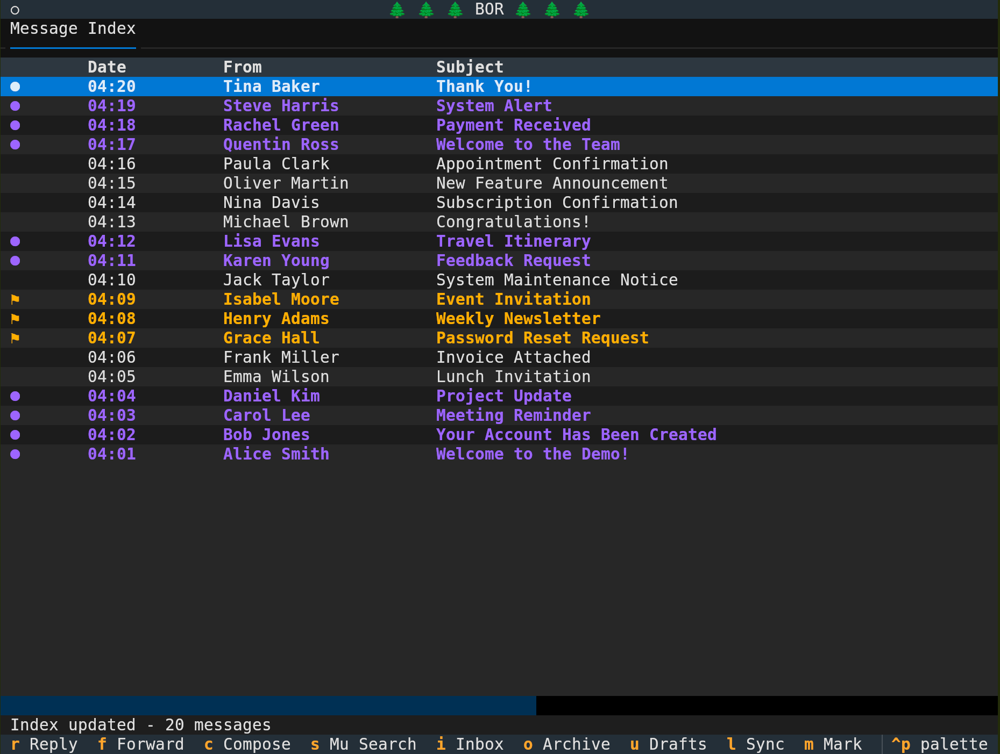
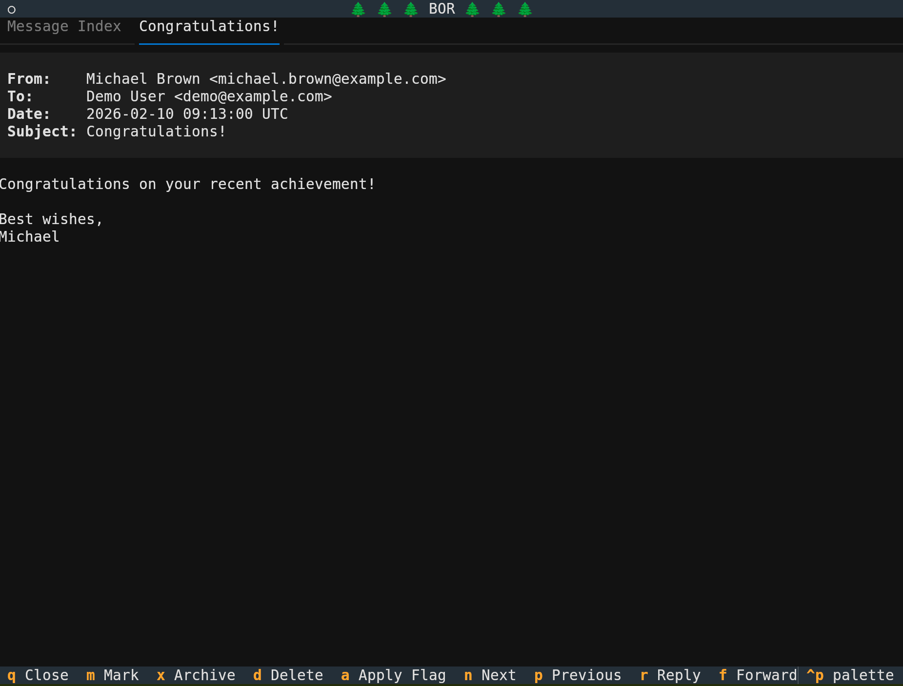
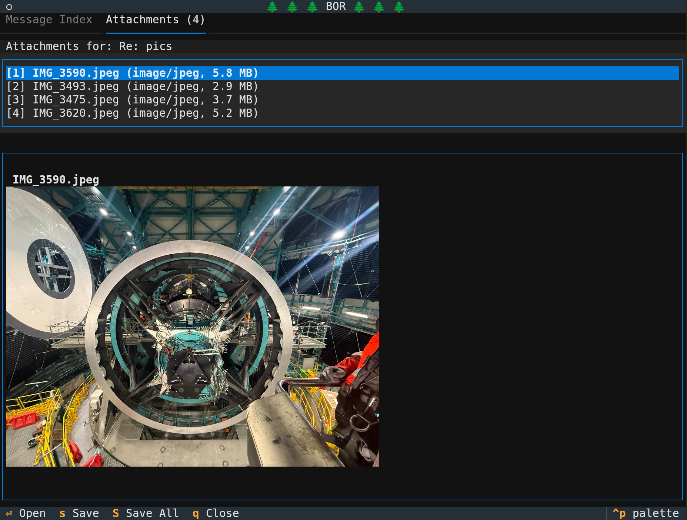

# Bor - Terminal Email Reader

[](https://github.com/slosar/bor/actions/workflows/tests.yml)

Bor means pine in Slovenian. Bor is also an email reader inspired by [pine](https://en.wikipedia.org/wiki/Pine_%28email_client%29).

I used to use pine and later its derivatives (alpine, realpine) until it became unsustainable. I switched to mu4e over a decade ago, but while I liked many things, it was never quite perfect.

A few years ago I switched away from emacs to VSCode and with the advent of AI coding I finally bite the bullet and made my very own mail client that works exactly the way I want it. Think of bor as pine dragged (by its feet) into 2025.

Bor uses [mu](https://djcbsoftware.nl/code/mu/) for email access under the hoold and [Textual](https://textual.textualize.io/) for the user interface.

## Some screenshots

### Message index

### Tabbed message reading

### In-terminal preview using kitty terminal protocol


## Features

- **Fast email searching** using mu's powerful query language
- **Threaded message view** with visual indentation
- **Message composition** with address autocompletion and Ctrl-C/V/X handling global clipboard even in terminal
- **Attachment handling** with preview (using kitty terminal graphics capabilities) 
- **Keyboard-driven interface** 
- **Tab-based workflow** 
- **Configurable** via TOML configuration file
- **HTML email support** via html2text rendering

## Requirements

- Python 3.10+
- [mu](https://djcbsoftware.nl/code/mu/) (maildir indexer)
- [Textual](https://textual.textualize.io/) library
- Optional: html2text for HTML email rendering
- Optional: kitty terminal for image preview


## Known issues

- no support for folders. You can mu search with maildir:/folder, but all archived messages go to the archived folder. This is how my work-flow works. Feel free to add and make pull request.
- Clicking with mouse on the link does not work. For emails with one or two links, 'O' shortcut is preferrable, but for complex long messages, clicking on the link would be better.

## Installation

### From source

```bash
# Clone the repository
git clone https://github.com/your-repo/bor.git
cd bor

# Install with pip
pip install -e .

# Or install dependencies manually
pip install textual tomli html2text
```

### Dependencies

```bash
# Install mu on Debian/Ubuntu
sudo apt install maildir-utils

# Install mu on Arch Linux
sudo pacman -S mu

# Install mu on macOS
brew install mu
```

## Configuration

Copy the example configuration file and customize it:

```bash
cp bor.conf.example ~/.config/bor.conf
```

Edit `~/.config/bor.conf` to configure:
- SMTP server settings
- Maildir folder paths
- Display preferences
- Color scheme
- Synchronization command
- Email and text aliases

See the [configuration documentation](documentation/configuration.md) for details.

## Usage

Start Bor:

```bash
python -m bor.app
```

Or if installed:

```bash
bor
```

## Keyboard Shortcuts

### Global

| Key | Action |
|-----|--------|
| Alt+0 | Message Index tab |
| Alt+1-9 | Switch to tab |
| Ctrl+Q | Quit |

### Message Index

| Key | Action |
|-----|--------|
| ↑/↓ or N/P | Navigate messages |
| Enter | Open message |
| R | Reply |
| F | Forward |
| C | Compose new |
| S | Search (mu query) |
| I | Show Inbox |
| O | Show Archive |
| U | Show Drafts |
| M | Mark message |
| X | Archive message(s) |
| A | Apply flag |
| D | Delete message(s) |
| E | Edit draft |
| T | Toggle threading |
| Ctrl+T | Show thread |
| L | Sync |
| Z | Undo move |
| Ctrl+R | Refresh index |

### Message View

| Key | Action |
|-----|--------|
| Space/PgDn | Scroll down |
| < | Return to index (keep tab open) |
| Q | Close tab and return |
| N/P | Next/Previous message |
| R | Reply |
| F | Forward |
| C | Compose new |
| M | Mark/unmark message and advance |
| X | Archive |
| D | Delete |
| A | Apply flag |
| O | Open URL (if multiple, pick [1-9]) |
| Z | View attachments |
| Ctrl+R | Toggle full headers |

### Compose

| Key | Action |
|-----|--------|
| Tab | Autocomplete address/text |
| Ctrl+L L | Send message |
| Ctrl+L D | Save draft |
| Ctrl+L X | Cancel |
| Ctrl+I | Insert file |
| Ctrl+A | Attach file |

### Attachments

| Key | Action |
|-----|--------|
| 1-9 | Select attachment |
| Enter | Open with system viewer |
| S | Save attachment |
| Shift+S | Save all |
| Q or Esc | Close and return to message view |
| < | Return to index (keep tab open) |

**URL opener limitation**

The URL picker shows and opens the first 9 URLs. If a message has more than 9 URLs, it is easier to copy/paste the link or use terminal link clicking instead.

## Search Queries

Bor uses mu's query language. Examples:

```
# Search in inbox
maildir:/INBOX

# Unread messages
flag:unread

# From a specific sender
from:john@example.com

# Subject contains word
subject:meeting

# Date range
date:1w..now

# Combine queries
from:john subject:meeting flag:unread
```

See the [mu query documentation](https://djcbsoftware.nl/code/mu/mu4e/Queries.html) for more.

## Development

### Project Structure

```
bor/
├── __init__.py       # Package init
├── app.py            # Main Textual application
├── config.py         # Configuration handling
├── mu.py             # Mu interface
└── tabs/
    ├── __init__.py
    ├── base.py       # Base tab class
    ├── message_index.py
    ├── message.py
    ├── compose.py
    ├── attachments.py
    └── sync.py
```

### Running tests

```bash
pytest tests/
```

## License

MIT License - see LICENSE file for details.

## Credits

- [mu/mu4e](https://djcbsoftware.nl/code/mu/) - Email indexing and searching
- [Textual](https://textual.textualize.io/) - TUI framework
- Inspired by traditional email clients like pine, mutt, and mu4e
